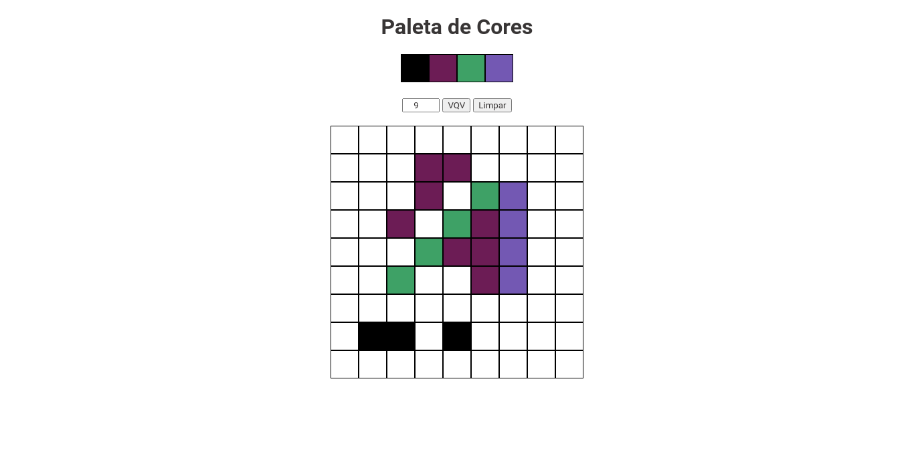

# Trybe Project Pixels Art 08/07/2021
 

  
  
  

 

## Habilidades

- Manipular o DOM;
- Manipular o Javascript.

## Desenvolvimento
Uma [página web](https://weltonthomasferreira.github.io/trybe-project-pixels-art/) que contém uma paleta de cores funcional que poderá ser utilizada para criar desenhos em pixels.

## Resultados

- `3` dia de projeto;
- `12` requisitos;
- Percentual de cumprimento de requisitos obrigatórios `100.00%`;
- Percentual de cumprimento de requisitos totais `100.00%`.

